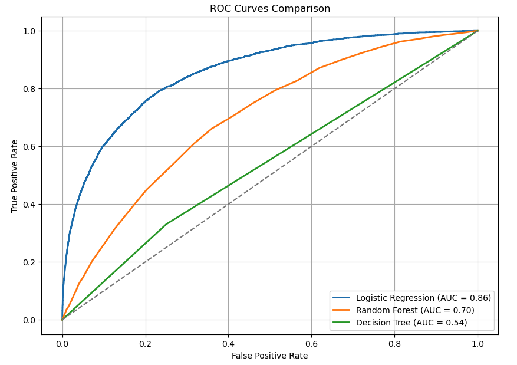

# 🧠 Santander Customer Transaction Prediction

A binary classification project built using **Logistic Regression** to identify whether a customer will make a transaction, based on anonymized features. This project is based on a [Kaggle competition](https://www.kaggle.com/competitions/santander-customer-transaction-prediction).

---

## 📁 Project Structure

- `Santander_Classification.ipynb` – Complete EDA, preprocessing, model training & evaluation.
- `train.csv` – Training data (from Kaggle).
- `test.csv` – Test data (from Kaggle).
- `submission.csv` – (Optional) Predictions for Kaggle submission.
- `README.md` – You're reading it!

---

## ⚙️ Problem Statement

> Predict whether a customer will make a transaction (1) or not (0), based on 200 anonymized numerical features.

---

## ✅ Techniques Used

- Data cleaning (duplicates, missing values)
- Class imbalance handling using **SMOTE**
- Feature scaling with **StandardScaler**
- Models trained:  
  - Logistic Regression (best model)  
  - Random Forest  
  - Decision Tree  
- Evaluation: Confusion Matrix, Precision, Recall, F1-score, ROC-AUC
- ROC curve visualization
- Final prediction on test data

---

## 🏆 Best Model Performance

**Logistic Regression**
- ROC-AUC: `0.86`
- Recall (Class 1): `0.76`
- F1-score (Class 1): `0.42`

---

## 📊 ROC Curve Comparison



---

## 🚀 How to Run

1. Clone the repo:
   ```bash
   git clone https://github.com/your-username/santander-prediction.git
   cd santander-prediction
   ```
2. Download the dataset from Kaggle:
https://www.kaggle.com/competitions/santander-customer-transaction-prediction/data

3. Place train.csv and test.csv in the data/ folder

4. Install required packages:
   ```bash
   pip install -r requirements.txt
   ```

5. Open Jupyter and run the notebook:
   ```bash
   jupyter notebook Santander_Classification.ipynb
   ```

---

## 📌 Note

To keep the repo size small, you can:
- Remove `train.csv`/`test.csv`
- And mention:
  > Download the dataset from [this Kaggle link](https://www.kaggle.com/competitions/santander-customer-transaction-prediction/data)

---

## 📮 Contact

Feel free to connect on LinkedIn - https://www.linkedin.com/in/yousufmohammed-989aaa1b8 or drop a message!

---

## 💡 Future Work

- Add LightGBM and XGBoost
- Hyperparameter tuning (GridSearchCV)
- Feature engineering & selection
- Precision-recall tuning
